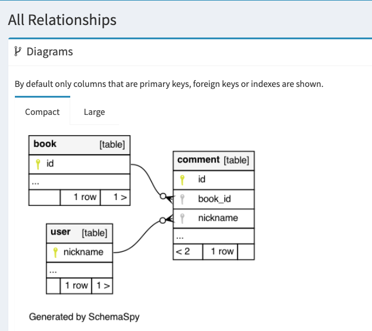

# AutoQuality-Playground 

[Slides: La automatización como protagonista en la calidad del código](https://docs.google.com/presentation/d/1_b0LnPXTKBgKtzg5HX3rdSgU85CRvnMGI-c8R5bkqF0/edit?usp=sharing)

## Description

Un repositorio donde se exploran técnicas de automatización para garantizar la calidad del código.

Contiene una aplicación ejemplo en Java/Spring Boot [demo](demo)
La aplicación también incluye una API REST para gestionar libros, comentarios de los libros y usuarios

## Quality Automation Tools

- [Error Prone](error-prone.md)

- [Arch Unit](archunit.md)
  
- [Zally](zally.md)

- [Open Rewrite](openRewrite.md)

- [Renovate](renovate.md)
